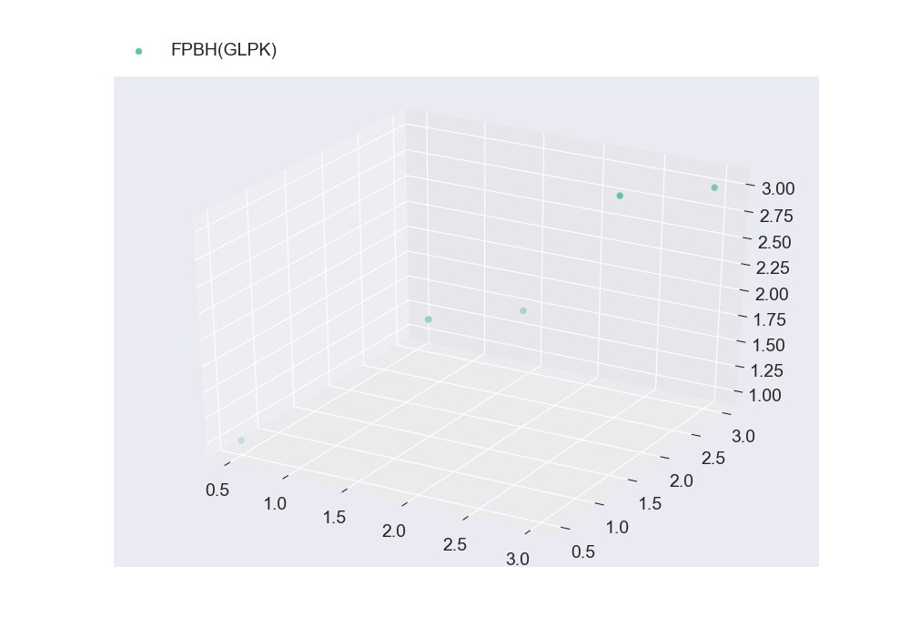

# Getting Started #

```julia
using Modof, JuMP, FPBH, GLPKMathProgInterface, Clp
```

## Warm Up FPBH: ##

[FPBH.jl](https://github.com/aritrasep/FPBH.jl) has four implementations, one each for biobjective pure binary, biobjective mixed binary, multiobjective pure binary and multiobjective mixed binary program. Thus, it is recommended that before `fpbh` is used for any actual instance, `warmup_fpbh` is used to compile all of the four implementations.

### Using Clp as the underlying LP Solver to warm up FPBH ###

```julia
warmup_fpbh(lp_solver=ClpSolver(), threads=1)
```

## Using JuMP Extension: ##

Providing the following multi-objective mixed integer linear program as a ModoModel:

$$\begin{aligned} \min \: & x_1 + x_2 + y_1 + y_2 \\ \max \: & x_1 + x_2 + y_1 + y_2 \\ \min \: & x_1 + 2x_2 + y_1 + 2y_2 \\ \text{s.t. } & x_1 + x_2 \leq 1 \\ & y_1 + 2y_2 \geq 1 \\ & x_1, x_2 \in \{0, 1\} \\ & y_1, y_2 \geq 0 \end{aligned}$$

```julia
model = ModoModel()
@variable(model, x[1:2], Bin)
@variable(model, y[1:2] >= 0.0)
objective!(model, 1, :Min, x[1] + x[2] + y[1] + y[2])
objective!(model, 2, :Max, x[1] + x[2] + y[1] + y[2])
objective!(model, 3, :Min, x[1] + 2x[2] + y[1] + 2y[2])
@constraint(model, x[1] + x[2] <= 1) 
@constraint(model, y[1] + 2y[2] >= 1)
```

**Note:** Currently constant terms in the objective functions are not supported

### Using GLPK as the underlying LP Solver, and imposing a maximum timelimit of 10.0 seconds ###

```julia
@time solutions = fpbh(model, timelimit=10.0)
```

### Writing nondominated frontier to a file ###

```julia
write_nondominated_frontier(solutions, "nondominated_frontier.txt")
```

### Writing nondominated solutions to a file ###

```julia
write_nondominated_sols(solutions, "nondominated_solutions.txt")
```

### Nondominated frontier ###

```julia
nondominated_frontier = wrap_sols_into_array(solutions)
```

### Hypervolume of the nondominated frontier ###

For this functionality, [pyModofSup.jl](https://github.com/aritrasep/pyModofSup.jl) must be properly installed.

```julia
using pyModofSup
```

`compute_hypervolume_of_a_discrete_frontier` can be used for computing the hypervolume of a nondominated frontier, however all the objectives must be minimizations. 

```julia
nondominated_frontier[:, 2] = -1.0*nondominated_frontier[:, 2] # Converting the second objective function values into minimization 
compute_hypervolume_of_a_discrete_frontier(nondominated_frontier)
```

### Plotting the nondominated frontier ###

For this functionality, [pyModofSup.jl](https://github.com/aritrasep/pyModofSup.jl) must be properly installed.

```julia
using pyModofSup
```

It is important to note that the plotting functions only work through IJulia. For just viewing the nondominated frontier, one can use the following instructions in an IJulia cell:

```julia
nondominated_frontier = wrap_sols_into_array(solutions)
plt_discrete_non_dom_frntr([nondominated_frontier], ["FPBH(GLPK)"])
```



However, if the user desires to save the plot of the nondominated frontier to a file ("Plot1.png" in this case), they can use the following instructions in a `julia` terminal: 

```julia
nondominated_frontier = wrap_sols_into_array(solutions)
plt_discrete_non_dom_frntr([nondominated_frontier], ["FPBH(GLPK)"], false, "Plot1.png")
```

### Using CLP instead of GLPK as the underlying LP Solver, and imposing a maximum timelimit of 10.0 seconds ###

```julia
@time solutions = fpbh(model, lp_solver=ClpSolver(), timelimit=10.0)
```

## Using LP File Format ##

Providing the following multiobjective mixed integer linear program as a [LP file](http://lpsolve.sourceforge.net/5.1/lp-format.htm):

$$\begin{aligned} \min \: & x_1 + x_2 + y_1 + y_2 \\ \max \: & x_1 + x_2 + y_1 + y_2 \\ \min \: & x_1 + 2x_2 + y_1 + 2y_2 \\ \text{s.t. } & x_1 + x_2 \leq 1 \\ & y_1 + 2y_2 \geq 1 \\ & x_1, x_2 \in \{0, 1\} \\ & y_1, y_2 \geq 0 \end{aligned}$$

### Format: ###

1. The first objective function should follow the convention of [LP format of single objective optimization problem](http://lpsolve.sourceforge.net/5.1/lp-format.htm)
2. **The other objective functions should be added as constraints with RHS = 0, at the end of the constraint matrix in the respective order**
3. Variables and constraints should also follow the convention of [LP format of single objective optimization problem](http://lpsolve.sourceforge.net/5.1/lp-format.htm)

```julia
write("Test.lp", "\\ENCODING=ISO-8859-1
\\Problem name: TestLPFormat

Minimize
 obj: x1 + x2 + x3 + x4
Subject To
 c1: x1 + x2 <= 1
 c2: x3 + 2 x4 >= 1
 c3: x1 + x2 + x3 + x4  = 0
 c4: x1 + 2 x2 + x3 + 2 x4  = 0
Binaries
 x1  x2 
End\n") # Writing the LP file of the above multiobjective mixed integer program to Test.lp
```

### Using GLPK as the underlying LP Solver, and imposing a maximum timelimit of 10.0 seconds ###

The sense of the first objective function is automatically detected from the LP file, however the senses of the rest of the objective functions should be provided in the proper order.

```julia
@time solutions = fpbh("Test.lp", [:Max, :Min], timelimit=10.0)
```

### Using CLP instead of GLPK as the underlying LP Solver, and imposing a maximum timelimit of 10.0 seconds ###

```julia
@time solutions = fpbh("Test.lp", [:Max, :Min], lp_solver=ClpSolver(), timelimit=10.0)
```

## Using MPS File Format ##

Providing the following multiobjective mixed integer linear program as a [MPS file](http://lpsolve.sourceforge.net/5.5/mps-format.htm):

$$\begin{aligned} \min \: & x_1 + x_2 + y_1 + y_2 \\ \max \: & x_1 + x_2 + y_1 + y_2 \\ \min \: & x_1 + 2x_2 + y_1 + 2y_2 \\ \text{s.t. } & x_1 + x_2 \leq 1 \\ & y_1 + 2y_2 \geq 1 \\ & x_1, x_2 \in \{0, 1\} \\ & y_1, y_2 \geq 0 \end{aligned}$$

### Format: ###

1. The first objective function should follow the convention of [MPS format of single objective optimization problem](http://lpsolve.sourceforge.net/5.5/mps-format.htm)
2. **The other objective functions should be added as constraints with RHS = 0, at the end of the constraint matrix in the respective order**
3. Variables and constraints should also follow the convention of [MPS format of single objective optimization problem](http://lpsolve.sourceforge.net/5.5/mps-format.htm)

```julia
write("Test.mps", "NAME   TestMPSFormat
ROWS
 N  OBJ
 L  CON1
 G  CON2
 E  CON3
 E  CON4
COLUMNS
    MARKER    'MARKER'                 'INTORG'
    VAR1  CON1  1
    VAR1  CON3  1
    VAR1  CON4  1
    VAR1  OBJ  1
    VAR2  CON1  1
    VAR2  CON3  1
    VAR2  CON4  2
    VAR2  OBJ  1
    MARKER    'MARKER'                 'INTEND'
    VAR3  CON2  1
    VAR3  CON3  1
    VAR3  CON4  1
    VAR3  OBJ  1
    VAR4  CON2  2
    VAR4  CON3  1
    VAR4  CON4  2
    VAR4  OBJ  1
RHS
    rhs    CON1    1
    rhs    CON2    1
    rhs    CON3    0
    rhs    CON4    0
BOUNDS
  UP BOUND VAR1 1
  UP BOUND VAR2 1
  PL BOUND VAR3
  PL BOUND VAR4
ENDATA\n") # Writing the MPS file of the above multiobjective mixed integer program to Test.mps
```

### Using GLPK as the underlying LP Solver, and imposing a maximum timelimit of 10.0 seconds ###

The sense of the first objective function is automatically detected from the MPS file, however the senses of the rest of the objective functions should be provided in the proper order.

```julia
@time solutions = fpbh("Test.mps", [:Max, :Min], timelimit=10.0)
```

### Using CLP instead of GLPK as the underlying LP Solver, and imposing a maximum timelimit of 10.0 seconds ###

```julia
@time solutions = fpbh("Test.mps", [:Max, :Min], lp_solver=ClpSolver(), timelimit=10.0)
```

## Using the Matrix Format - Advanced ##
