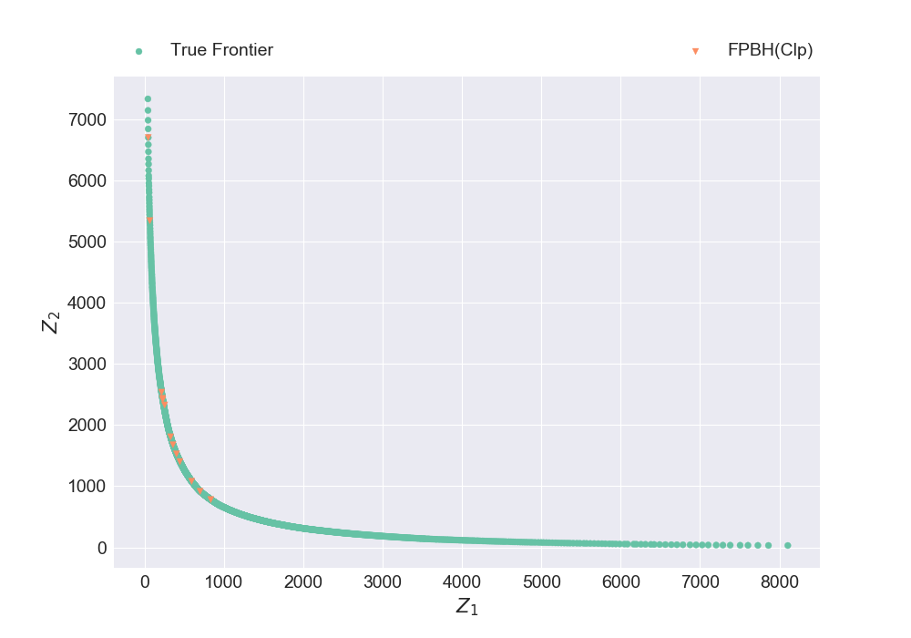
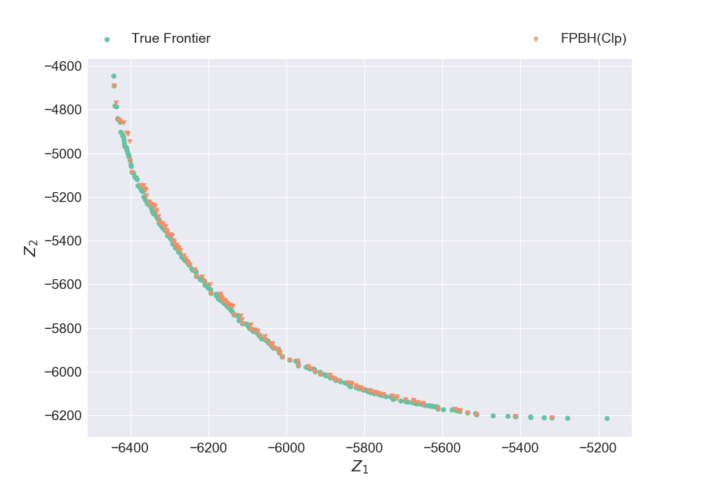
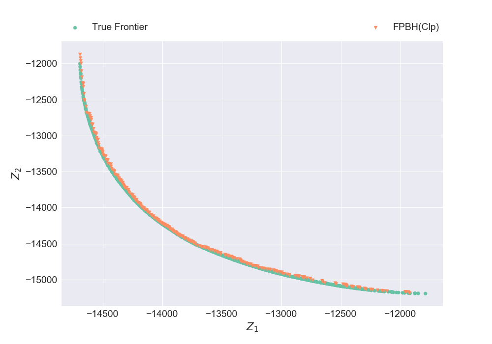
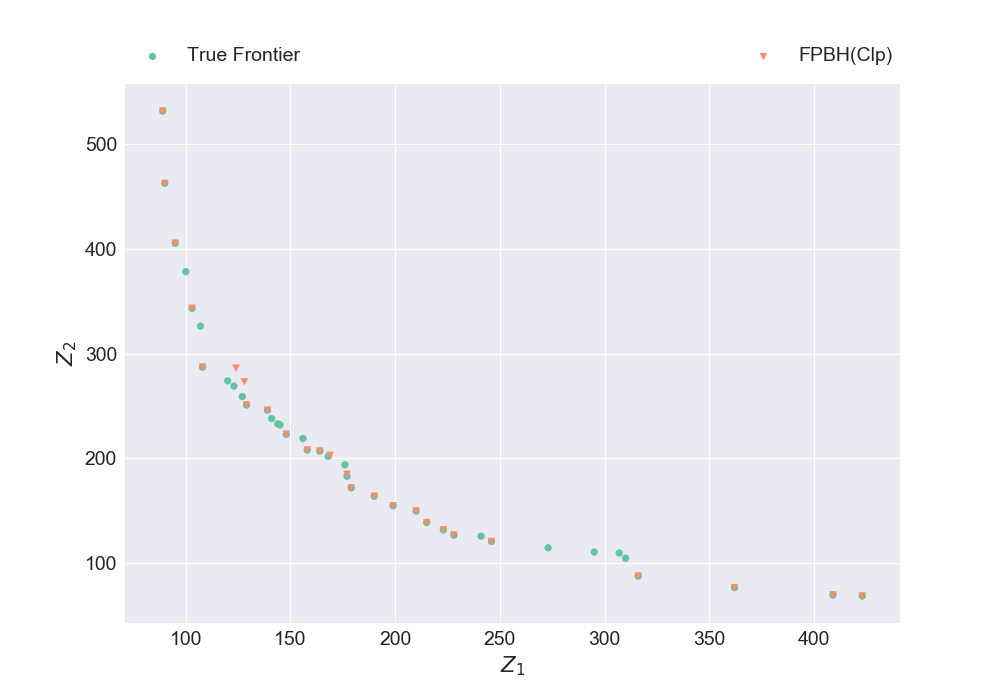
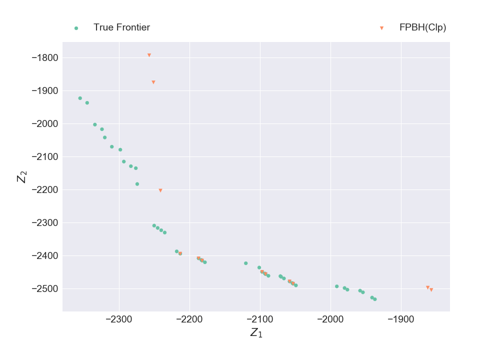
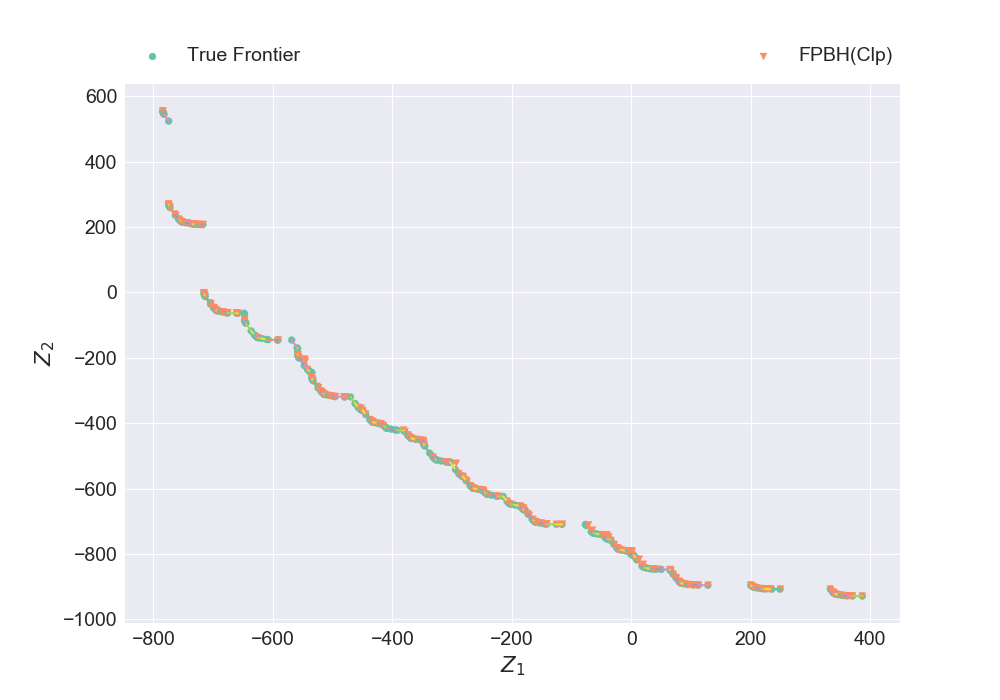
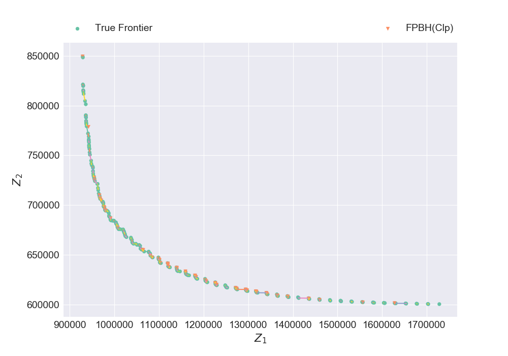
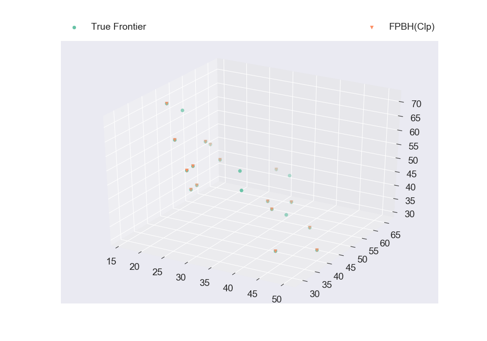
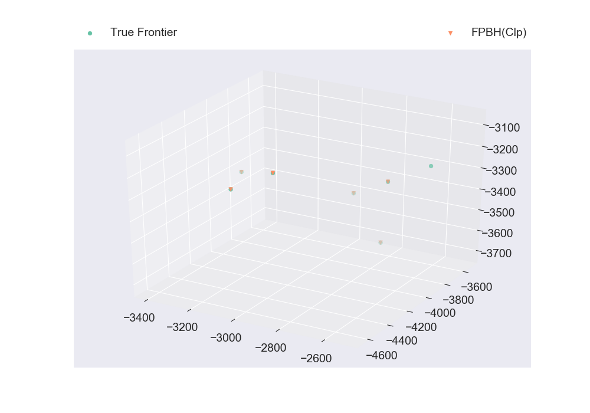
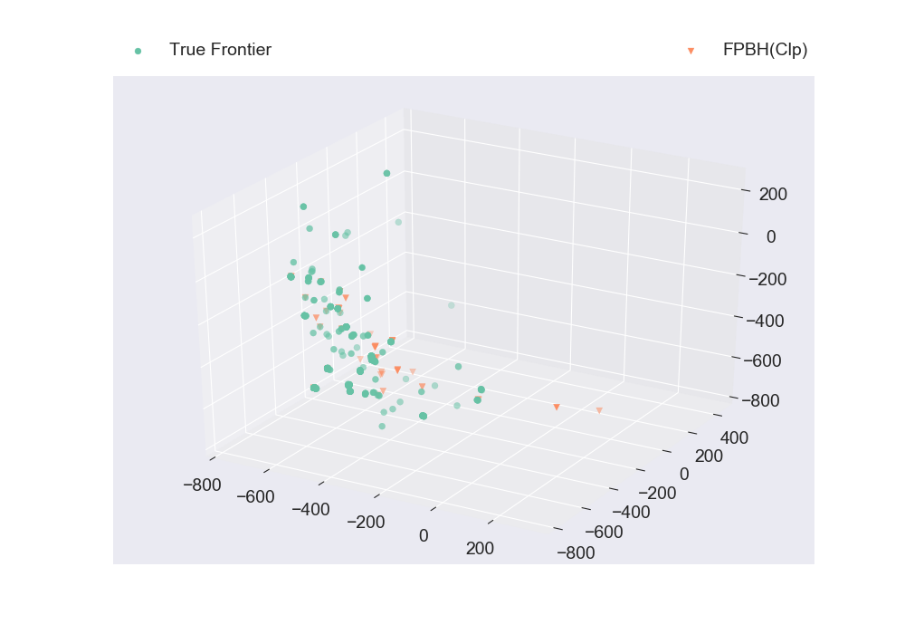

# Solving multiobjective optimization instances from literature using [Modolib.jl](https://github.com/aritrasep/Modolib.jl): #

```julia
using Modolib
```

## Biobjective assignment problems: ##

```julia
instance, true_frontier = read_boap_hadi(10)
```

```julia
@time solutions = fpbh(instance, lp_solver=ClpSolver(), timelimit=10.0)
```

```julia
nondominated_frontier = wrap_sols_into_array(solutions)
```

### Computing quality of the frontier w.r.t. true frontier without normalization ###

```julia
hg, c, mc, ac, u = compute_quality_of_apprx_frontier(nondominated_frontier, true_frontier)
println("
    Hypervolume Gap = $hg % 
    Cardinality = $c % 
    Maximum Coverage = $mc 
    Average Coverage = $ac 
    Uniformity = $u")
```

### Computing quality of the frontier w.r.t. true frontier with normalization ###

```julia
hg, c, mc, ac, u = compute_quality_of_norm_apprx_frontier(nondominated_frontier, true_frontier)
println("
    Hypervolume Gap = $hg % 
    Cardinality = $c % 
    Maximum Coverage = $mc 
    Average Coverage = $ac 
    Uniformity = $u")
```

### Comparing the nondominated frontier of FPBH with the true frontier ###

```julia
plt_discrete_non_dom_frntr([true_frontier, nondominated_frontier], ["True Frontier", "FPBH(Clp)"], false, "Plot2.png")
```



## Biobjective 1-D knapsack problems: ##

```julia
instance, true_frontier = read_bokp_xavier1("2KP150-1A")
```

```julia
@time solutions = fpbh(instance, lp_solver=ClpSolver(), timelimit=10.0)
```

```julia
nondominated_frontier = wrap_sols_into_array(solutions)
```

### Comparing the nondominated frontier of FPBH with the true frontier ###

```julia
plt_discrete_non_dom_frntr([true_frontier, nondominated_frontier], ["True Frontier", "FPBH(Clp)"], false, "Plot3.png")
```



## Biobjective 2-D knapsack problems: ##

```julia
instance, true_frontier = read_bokp_hadi(1)
```

```julia
@time solutions = fpbh(instance, lp_solver=ClpSolver(), timelimit=10.0)
```

```julia
nondominated_frontier = wrap_sols_into_array(solutions)
```

### Comparing the nondominated frontier of FPBH with the true frontier ###

```julia
plt_discrete_non_dom_frntr([true_frontier, nondominated_frontier], ["True Frontier", "FPBH(Clp)"], false, "Plot4.png")
```



## Biobjective set covering problems: ##

```julia
instance, true_frontier = read_boscp_xavier(100, 10, "a")
```

```julia
@time solutions = fpbh(instance, lp_solver=ClpSolver(), timelimit=10.0)
```

```julia
nondominated_frontier = wrap_sols_into_array(solutions)
```

### Comparing the nondominated frontier of FPBH with the true frontier ###

```julia
plt_discrete_non_dom_frntr([true_frontier, nondominated_frontier], ["True Frontier", "FPBH(Clp)"], false, "Plot5.png")
```



## Biobjective set packing problems: ##

```julia
instance, true_frontier = read_bospp_xavier("2mis100_300A")
```

```julia
@time solutions = fpbh(instance, lp_solver=ClpSolver(), timelimit=10.0)
```

```julia
nondominated_frontier = wrap_sols_into_array(solutions)
```

### Comparing the nondominated frontier of FPBH with the true frontier ###

```julia
plt_discrete_non_dom_frntr([true_frontier, nondominated_frontier], ["True Frontier", "FPBH(Clp)"], false, "Plot6.png")
```



## Biobjective mixed binary problems: ##

```julia
instance, true_frontier = read_bomip_hadi(6)
```

```julia
@time solutions = fpbh(instance, lp_solver=ClpSolver(), timelimit=10.0)
```

```julia
nondominated_frontier = wrap_sols_into_array(solutions)
```

### Quality of the frontier w.r.t. true frontier without normalization ###

```julia
hg, c, mc, ac, u = compute_quality_of_apprx_frontier(nondominated_frontier, true_frontier, true)
println("
    Hypervolume Gap = $hg % 
    Cardinality = $c % 
    Maximum Coverage = $mc 
    Average Coverage = $ac 
    Uniformity = $u")
```

### Quality of the frontier w.r.t. true frontier with normalization ###

```julia
hg, c, mc, ac, u = compute_quality_of_norm_apprx_frontier(nondominated_frontier, true_frontier, true)
println("
    Hypervolume Gap = $hg % 
    Cardinality = $c % 
    Maximum Coverage = $mc 
    Average Coverage = $ac 
    Uniformity = $u")
```

### Comparing the nondominated frontier of FPBH with the true frontier ###

```julia
plt_non_dom_frntr_bomip([true_frontier, nondominated_frontier], ["True Frontier", "FPBH(Clp)"], "Plot7.png")
```



## Biobjective uncapacitated facility location problems: ##

```julia
instance, true_frontier = read_bouflp_hadi(12)
```

```julia
@time solutions = fpbh(instance, lp_solver=ClpSolver(), timelimit=10.0)
```

```julia
nondominated_frontier = wrap_sols_into_array(solutions)
```

### Comparing the nondominated frontier of FPBH with the true frontier ###

```julia
plt_non_dom_frntr_bomip([true_frontier, nondominated_frontier], ["True Frontier", "FPBH(Clp)"], "Plot8.png")
```



## Triobjective assignment problems: ##

```julia
instance, true_frontier = read_moap_kirlik(3, 5, 1)
```

```julia
@time solutions = fpbh(instance, lp_solver=ClpSolver(), timelimit=10.0)
```

```julia
nondominated_frontier = wrap_sols_into_array(solutions)
```

### Computing quality of the frontier w.r.t. true frontier without normalization ###

```julia
hg, c, mc, ac, u = compute_quality_of_apprx_frontier(nondominated_frontier, true_frontier)
println("
    Hypervolume Gap = $hg % 
    Cardinality = $c % 
    Maximum Coverage = $mc 
    Average Coverage = $ac 
    Uniformity = $u")
```

### Computing quality of the frontier w.r.t. true frontier with normalization ###

```julia
hg, c, mc, ac, u = compute_quality_of_norm_apprx_frontier(nondominated_frontier, true_frontier)
println("
    Hypervolume Gap = $hg % 
    Cardinality = $c % 
    Maximum Coverage = $mc 
    Average Coverage = $ac 
    Uniformity = $u")
```

### Comparing the nondominated frontier of FPBH with the true frontier ###

```julia
plt_discrete_non_dom_frntr([true_frontier, nondominated_frontier], ["True Frontier", "FPBH(Clp)"],  false, "Plot9.png")
```



## Triobjective 1-D knapsack problems: ##

```julia
instance, true_frontier = read_mokp_kirlik(3, 10, 1)
```

```julia
@time solutions = fpbh(instance, lp_solver=ClpSolver(), timelimit=10.0)
```

```julia
nondominated_frontier = wrap_sols_into_array(solutions)
```

### Comparing the nondominated frontier of FPBH with the true frontier ###

```julia
plt_discrete_non_dom_frntr([true_frontier, nondominated_frontier], ["True Frontier", "FPBH(Clp)"], false, "Plot10.png")
```



## Triobjective mixed binary problems: ##

```julia
instance, true_frontier = read_mombp_aritra(3, 320, 1)
```

```julia
@time solutions = fpbh(instance, lp_solver=ClpSolver(), timelimit=10.0)
```

```julia
nondominated_frontier = wrap_sols_into_array(solutions)
```

### Comparing the nondominated frontier of FPBH with the reference frontier ###

```julia
plt_discrete_non_dom_frntr([true_frontier, nondominated_frontier], ["True Frontier", "FPBH(Clp)"], false, "Plot11.png")
```


